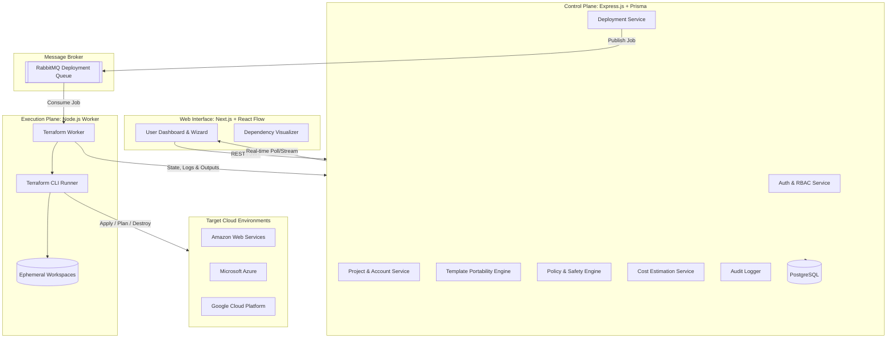
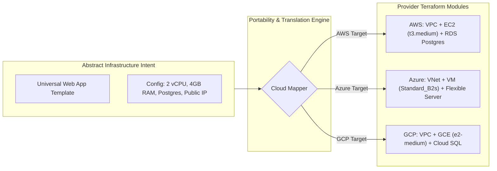

# Expanded Phase-by-Phase Implementation Plan
## Multi-Cloud Infrastructure Automation Platform

This document presents the definitive, fully expanded engineering execution plan for the **Multi-Cloud Infrastructure Automation Platform**, synthesizing the functional requirements from the **Project Explanation Document** and technical specifications from the **Technical Architecture & Implementation Document**.

---

## Architectural Principles & Invariants Reference Matrix

Before breaking down individual phases, the following core system invariants govern every phase of development:

| Principle / Invariant | Enforcement Layer | Description |
| :--- | :--- | :--- |
| **Authoritative Backend** | Express Middleware & Services | Frontend permissions are for UX/display only. All authorization, RBAC, and safety checks are strictly enforced in the backend. |
| **Separation of Plan & Apply** | Orchestration & Worker | `Plan` generates preview and risk analysis. `Apply` requires separate approval and execution state. Never combine into a single blind step. |
| **Asynchronous Execution** | RabbitMQ + Worker Service | Terraform operations never execute in synchronous HTTP request threads. Work is queued and executed in isolated worker processes. |
| **Single Active Execution Lock** | Database / Redis Mutex | Only one active deployment/destroy job can run on a given `(Project, Environment)` tuple at a time to prevent state collision. |
| **Zero Secret Leakage** | Crypto Service & Sanitizer | Cloud credentials and secrets are encrypted at rest (AES-256-GCM), never returned to frontend payloads, and sanitized from execution logs. |
| **Confirmed Destruction** | Guardrails + UI Confirmation | Destructive operations (`operationType = DESTROY`) require explicit high-privilege confirmation, safety policy re-evaluation, and separate audit trails. |
| **Stateless Worker Isolation** | Isolated Execution Workspaces | Each worker run clones or instantiates Terraform code in an ephemeral, unique workspace directory with isolated state backends. |

---

---

## Phase 1 — Core AWS MVP

**Goal**: Deliver a production-grade, end-to-end controlled infrastructure lifecycle targeting AWS with strict state tracking, asynchronous worker execution, and complete auditability.

### Sub-Phase 1.1: Project Scaffolding, Database Modeling & Core Infrastructure
- **1.1.1 Monorepo / Directory Setup**:
  - Scaffolding `backend/` (Express, TypeScript, Prisma, Jest) and `frontend/` (Next.js 14 App Router, TypeScript, Tailwind CSS, TanStack Query).
  - Common configuration: shared environment schemas using `zod`, ESLint, Prettier, and path aliases.
- **1.1.2 PostgreSQL & Prisma Schema Definition**:
  - Implement models specified in Section 7 of Document 2:
    - `User`: `id`, `name`, `email`, `passwordHash`, `role` (`ADMIN`, `DEVELOPER`, `VIEWER`), `createdAt`, `updatedAt`.
    - `CloudAccount`: `id`, `provider` (`AWS`, `AZURE`, `GCP`), `accountReference`, `encryptedCredentialReference`, `ownerId`, `projectId`, `createdAt`.
    - `Project`: `id`, `name`, `description`, `ownerId`, `createdAt`.
    - `Environment`: `id`, `projectId`, `name` (`development`, `staging`, `production`), `cloudAccountId`.
    - `Template`: `id`, `name`, `provider` (`AWS`, `CROSS_CLOUD`), `version`, `inputSchema` (JSONSchema), `templateReference`.
    - `Deployment`: `id`, `projectId`, `environmentId`, `templateId`, `userId`, `operationType` (`CREATE`, `MODIFY`, `DESTROY`), `status` (`DRAFT`, `PLANNING`, `PLANNED`, `QUEUED`, `RUNNING`, `SUCCEEDED`, `FAILED`, `CANCELLED`), `planOutput`, `applyOutput`, `planTime`, `applyTime`.
    - `Resource`: `id`, `deploymentId`, `provider`, `resourceType`, `providerResourceId`, `status`, `outputs` (JSON), `dependencies` (JSON).
    - `AuditLog`: `id`, `userId`, `action`, `entityType`, `entityId`, `timestamp`, `status`, `message`, `metadata` (JSON).
- **1.1.3 Security & Encryption Core**:
  - Implementation of AES-256-GCM encryption utility for credentials (`encryptCredential()`, `decryptCredential()`).
  - Secret mask sanitization filter for logs and output streams.

### Sub-Phase 1.2: Identity, RBAC & Context Management
- **1.2.1 Auth Module**:
  - Registration, login, password hashing with `argon2` or `bcrypt`.
  - JWT token generation with refresh token rotation and HttpOnly cookies.
- **1.2.2 Authorization & Guard Middleware**:
  - `authenticateToken` middleware parsing JWT and attaching active user context.
  - `requireRole(['ADMIN', 'DEVELOPER'])` role-checking middleware.
  - Explicit destructive action guard: `requireDestructivePermission` verifying user role before allowing deletion operations.
- **1.2.3 Cloud Account & Project/Environment Management APIs**:
  - Project CRUD with environment binding (`dev`, `stage`, `prod`).
  - AWS Cloud Account onboarding endpoint: validates AWS credentials (STS `GetCallerIdentity` check) before persisting encrypted credentials.

### Sub-Phase 1.3: AWS Terraform Modules & Catalog Service
- **1.3.1 Canonical AWS Terraform Modules** (`backend/templates/aws/`):
  - `aws_vpc`: Modular VPC with public/private subnets, Internet Gateway, route tables.
  - `aws_ec2_web`: Standalone EC2 web application instance with security group, user-data startup script, and elastic IP.
  - `aws_rds_postgres`: Relational database instance with subnet group and credential generation.
  - `aws_s3_bucket`: Secure bucket with private ACL, encryption, and public access blocks.
- **1.3.2 Template Catalog Service**:
  - Ingestion and cataloging of templates with defined JSONSchema input specifications.
  - Dynamic input validation endpoint validating user-supplied values against template schemas before planning.

### Sub-Phase 1.4: Asynchronous Queue & Terraform Provisioning Worker
- **1.4.1 RabbitMQ Setup & Architecture**:
  - Message exchange and persistent queue setup: `deployment_jobs` and `deployment_events`.
  - Durable messaging and message acknowledgement (`ack`/`nack`).
- **1.4.2 Terraform Worker Process** (`backend/src/workers/terraform.worker.ts`):
  - Standalone Node.js process consuming jobs from RabbitMQ.
  - Workspace manager: creates isolated temporary directory per run (`/tmp/deployments/<deploymentId>/`).
  - Environment injector: safely injects decrypted cloud credentials into the worker child process environment (`AWS_ACCESS_KEY_ID`, `AWS_SECRET_ACCESS_KEY`, `AWS_REGION`).
  - Terraform runner wrapper:
    - Executes `terraform init -no-color`, `terraform plan -no-color -out=tfplan`, `terraform apply -no-color tfplan`, and `terraform destroy -no-color -auto-approve`.
    - Real-time stdout/stderr capture and chunk streaming to database/log storage.
    - Post-execution state parser: reads `terraform show -json` to extract created resource identifiers (`arn`, `id`, `public_ip`), outputs, and dependencies.
- **1.4.3 Concurrency & Lock Management**:
  - Deployment lock table / mutex ensuring no two concurrent jobs target the same environment.

### Sub-Phase 1.5: Canonical Deployment & Safe Destruction Lifecycle
- **1.5.1 Plan Generation Workflow**:
  - User submits configuration $\to$ backend validates input $\to$ status moves to `PLANNING` $\to$ worker runs `terraform plan` $\to$ status set to `PLANNED` $\to$ parsed summary (resources to add/change/destroy) returned to API.
- **1.5.2 Approval Gate**:
  - An authorized user explicitly approves the planned deployment via `POST /api/deployments/:id/approve`.
  - Deployment transition: `PLANNED` $\to$ `QUEUED` $\to$ job dispatched to RabbitMQ.
- **1.5.3 Apply & State Finalization**:
  - Worker executes `apply`, updates deployment status to `RUNNING` then `SUCCEEDED` or `FAILED`.
  - Populates `Resource` table with mapped provider IDs and status.
- **1.5.4 Safe Destruction Workflow**:
  - User requests environment teardown $\to$ Backend checks permissions $\to$ worker runs `terraform plan -destroy` $\to$ User reviews destructive preview and submits explicit confirmation $\to$ worker runs `terraform destroy` $\to$ resources marked as `DESTROYED` $\to$ audit event logged.

### Sub-Phase 1.6: Frontend Core MVP Dashboard (Next.js)
- **1.6.1 Layout & Navigation**:
  - Unified navigation bar: Dashboard, Projects, Cloud Accounts, Template Catalog, Deployments, Audit Logs.
- **1.6.2 Deployment Wizard**:
  - Step 1: Project & Environment selector.
  - Step 2: Template selection card.
  - Step 3: Dynamic parameter form generated from JSONSchema.
  - Step 4: Plan Review Screen (diff view of resources to create/modify).
  - Step 5: Explicit Approval button with role validation.
- **1.6.3 Execution & Monitoring Screen**:
  - Live status indicator (`QUEUED` $\to$ `RUNNING` $\to$ `SUCCEEDED`).
  - Real-time log terminal view with auto-scroll and status badges.
  - Resource table showing deployed AWS resource IDs, types, and connection strings.
- **1.6.4 Safe Destruction Modal**:
  - Red-flagged confirmation dialog requiring the user to type the environment name to confirm destruction.

---

## Phase 2 — Multi-Cloud Expansion (Azure & GCP)

**Goal**: Extend the core provisioning engine across Microsoft Azure and Google Cloud Platform, and introduce the Cross-Cloud Template Portability layer.

### Sub-Phase 2.1: Cloud Account Credential Isolation for Azure & GCP
- **2.1.1 Azure Integration**:
  - Onboarding for Azure Service Principal (`AZURE_CLIENT_ID`, `AZURE_CLIENT_SECRET`, `AZURE_TENANT_ID`, `AZURE_SUBSCRIPTION_ID`).
  - Backend validation check via Azure Resource Manager REST ping (`Subscriptions - Get`).
- **2.1.2 GCP Integration**:
  - Onboarding for GCP Service Account JSON key (`GCP_PROJECT_ID`, `GCP_CLIENT_EMAIL`, `GCP_PRIVATE_KEY`).
  - Backend validation check via Google Cloud Resource Manager API (`projects.get`).

### Sub-Phase 2.2: Azure & GCP Terraform Modules
- **2.2.1 Azure Modular Templates** (`backend/templates/azure/`):
  - `azure_vnet`: Resource Group, Virtual Network, Subnets, Network Security Groups.
  - `azure_vm_web`: Linux Virtual Machine, Network Interface, Public IP.
  - `azure_postgres_flexible`: Azure Database for PostgreSQL Flexible Server.
  - `azure_blob_storage`: Storage Account with Blob container.
- **2.2.2 GCP Modular Templates** (`backend/templates/gcp/`):
  - `gcp_vpc`: Custom VPC Network, Subnetworks, Firewall rules.
  - `gcp_compute_web`: Compute Engine VM instance with startup script.
  - `gcp_cloud_sql_postgres`: Cloud SQL Postgres instance with authorized networks.
  - `gcp_storage_bucket`: Google Cloud Storage bucket with IAM controls.

### Sub-Phase 2.3: Cross-Cloud Template Portability Layer
- **2.3.1 Abstract Specification Framework**:
  - Define unified template archetype: `web-service-stack`, `storage-backend`, `secure-network`.
  - Universal configuration contract: instance tier (`small`, `medium`, `large`), storage capacity, region mapping.
- **2.3.2 Cloud Translation Engine**:
  - Provider translation lookup mapping abstract sizing to provider skus:
    - `compute.tier.small`: AWS `t3.micro`, Azure `Standard_B1s`, GCP `e2-micro`.
    - `compute.tier.medium`: AWS `t3.medium`, Azure `Standard_B2s`, GCP `e2-medium`.
    - `compute.tier.large`: AWS `t3.xlarge`, Azure `Standard_B4ms`, GCP `e2-standard-4`.
  - Regional mappings: normalizing regional selections across clouds (`us-east-1` $\leftrightarrow$ `eastus` $\leftrightarrow$ `us-east1`).
- **2.3.3 Unified Resource Output Normalizer**:
  - Normalizes heterogeneous provider outputs into common platform resource descriptors: `compute_public_ip`, `database_endpoint`, `storage_uri`.

---

## Phase 3 — Platform Differentiators

**Goal**: Implement the core platform value drivers: Policy-Based Deployment Safety, Cost Estimation & Comparison, and Interactive Dependency Visualization.

### Sub-Phase 3.1: Policy-Based Deployment Safety Engine
- **3.1.1 Policy Architecture & Rule Engine**:
  - Lightweight policy engine evaluating planned resource changes against organizational rules.
  - Rule evaluation severities: `ALLOW`, `WARN`, `REQUIRE_APPROVAL`, `BLOCK`.
- **3.1.2 Pre-defined Safety Rules**:
  - **Security Guardrails**:
    - Disallow unrestricted inbound SSH/RDP (`0.0.0.0/0` on port 22/3389).
    - Block unencrypted database or object storage creation.
  - **Compliance & Governance**:
    - Require mandatory tags (`Project`, `Environment`, `Owner`, `CostCenter`).
    - Enforce approved cloud region whitelists.
  - **Blast Radius & Sizing**:
    - Flag destruction of stateful storage or database clusters with `REQUIRE_APPROVAL`.
    - Warn on provisioned instances exceeding specified capacity limits.
- **3.1.3 Review Gate Integration**:
  - Policy evaluation runs immediately following `terraform plan`.
  - If a rule produces `BLOCK`, the approval button is hard-disabled with remediation feedback.
  - If `REQUIRE_APPROVAL`, an Admin-level role signature is strictly mandated.

### Sub-Phase 3.2: Cost-Aware Deployment Selection & Estimation
- **3.2.1 Cost Estimation Service**:
  - Integration with Infracost CLI or cloud pricing APIs to calculate planned delta cost.
  - Extracts baseline monthly cost before apply and calculates expected monthly delta (`+$34.50/mo`).
- **3.2.2 Multi-Cloud Cost Comparison Tool**:
  - When configuring a cross-cloud template, the frontend displays a side-by-side cost estimate:
    - AWS Deployment: estimated $48.20/month
    - Azure Deployment: estimated $42.50/month
    - GCP Deployment: estimated $45.10/month
  - Labels all figures explicitly as estimates with pricing timestamp, assumptions, and currency.

### Sub-Phase 3.3: Infrastructure Dependency Visualization (React Flow)
- **3.3.1 Graph Data Extraction**:
  - Post-deployment parser reads Terraform state relationships and custom template dependency definitions.
  - Converts resource connections into standard node-and-edge graphs:
    - `Internet Gateway / NSG` $\to$ `Load Balancer` $\to$ `Compute Instances` $\to$ `Database / Storage`.
- **3.3.2 Interactive Topology Visualizer (Frontend)**:
  - Powered by `React Flow`:
    - Distinct custom nodes with provider badges (AWS/Azure/GCP icons), status indicators (healthy green, provisioning pulsing yellow, error red).
    - Clicking a node opens an inspection drawer showing provider resource ID, private/public IP, creation timestamp, and live status.

---

## Phase 4 — DevOps, Infrastructure & Observability

**Goal**: Package the entire platform for production delivery using Docker, Kubernetes, NGINX, GitHub Actions CI/CD, and establish centralized telemetry with Prometheus, Grafana, and Loki.

### Sub-Phase 4.1: Production Containerization (Docker)
- **4.1.1 Multi-Stage Dockerfiles**:
  - `frontend.Dockerfile`: Node.js multi-stage build producing an optimized standalone Next.js production image.
  - `backend.Dockerfile`: Lean Node.js Alpine image running compiled Express TypeScript code with Prisma client generation.
  - `worker.Dockerfile`: Execution image bundling Node.js runtime, Terraform CLI binary, and AWS/Azure/GCP client utilities.
- **4.1.2 Docker Compose Local Orchestration**:
  - `docker-compose.yml` for unified local stack:
    - Services: `frontend`, `backend`, `worker`, `postgres`, `rabbitmq`, `nginx`.
    - Health checks and network dependencies cleanly mapped.

### Sub-Phase 4.2: CI/CD Pipeline (GitHub Actions)
- **4.2.1 Continuous Integration Workflow**:
  - Automated triggers on pull requests: linting, type-checking, Jest backend tests, Playwright frontend smoke tests.
- **4.2.2 Artifact & Image Publishing**:
  - Automated build and push of versioned Docker images to GitHub Container Registry (GHCR).

### Sub-Phase 4.3: Kubernetes Deployment & Ingress Routing
- **4.3.1 Kubernetes Manifests / Helm Chart**:
  - Namespace definitions, `ConfigMaps`, and `Secrets`.
  - Deployment workloads:
    - `api-deployment` (HPA configured for API autoscaling).
    - `worker-deployment` (Worker queue consumers).
    - `frontend-deployment`.
    - StatefulSets for PostgreSQL and RabbitMQ (or managed service bindings).
- **4.3.2 Ingress & Reverse Proxy**:
  - NGINX Ingress Controller routing:
    - `/api/*` routed to `api-service:4000`.
    - `/` routed to `frontend-service:3000`.
    - TLS termination with Let's Encrypt / Cert-Manager.

### Sub-Phase 4.4: Observability & Operational Notifications
- **4.4.1 Prometheus & Metrics**:
  - Express middleware exposing `/metrics` with `prom-client`:
    - Deployment durations, active queue job depth, API request latency, HTTP error rates.
- **4.4.2 Loki & Grafana Dashboards**:
  - Loki aggregation capturing worker execution logs and backend logs.
  - Pre-built Grafana dashboards displaying platform operational health, queue throughput, and deployment failure rates.
- **4.4.3 Multi-Channel Notifications**:
  - Event notification service sending alerts for `DEPLOYMENT_SUCCESS`, `DEPLOYMENT_FAILED`, and `POLICY_VIOLATION`.
  - Connectors for Email (SMTP/Resend), Slack Webhooks, and Discord Webhooks.

---

## Phase 5 — Advanced Capabilities & Capstone Polish

**Goal**: Implement differentiating advanced features, automated drift detection, smart error resolution, and prepare viva/presentation assets.

### Sub-Phase 5.1: AI-Powered Deployment Failure Assistant
- **5.1.1 Error Diagnosis Integration**:
  - When a deployment job transitions to `FAILED`, the log stream and error stack are processed by an LLM assistant (e.g. Gemini 1.5 Flash API).
  - Categorizes error type (e.g., Insufficient IAM permissions, CIDR block overlap, provider quota exceeded, syntax error).
  - Generates clear, non-technical explanation and actionable remediation suggestions.
- **5.1.2 Safety Constraint**:
  - The AI assistant is strictly advisory; it **never** automatically applies destructive actions or changes without manual user review and approval.

### Sub-Phase 5.2: Automated Drift Detection & Audit Trail
- **5.2.1 Cloud Drift Scanner**:
  - Scheduled or manually triggered background job running `terraform plan -detailed-exitcode` against deployed state.
  - Detects out-of-band modifications made directly in the cloud console (e.g., deleted security group rule, changed instance type).
  - Flags resources as `DRIFTED` in the dashboard with side-by-side attribute differences.
- **5.2.2 Comprehensive Audit & Compliance View**:
  - Filterable audit viewer displaying immutable logs: actor, timestamp, action type, IP address, target environment, and outcome.

### Sub-Phase 5.3: Scheduled Operations & Controlled Rollback
- **5.3.1 Infrastructure Scheduling**:
  - Automated cron scheduling for non-production environments (e.g., auto-stop dev instances at 8:00 PM, auto-start at 8:00 AM) to save cloud costs.
- **5.3.2 Controlled Rollback**:
  - Versioned deployment records allowing an operator to redeploy the previous known-good template configuration with explicit approval.

### Sub-Phase 5.4: Final Polish & Capstone Deliverables
- **5.4.1 End-to-End Testing & Verification**:
  - Full smoke test matrix: AWS Web App deploy & destroy, Azure Web App deploy & destroy, GCP Web App deploy & destroy.
  - Failure scenario verification (bad credentials, policy violation block, worker interruption).
- **5.4.2 Presentation & Viva Assets**:
  - Architecture walkthrough slide deck.
  - 1-paragraph viva pitch rehearsal and live demonstration script.

---

## Verification & Validation Plan

| Phase | Milestone Objective | Verification Method | Acceptance Criteria |
| :--- | :--- | :--- | :--- |
| **Phase 1** | AWS Core MVP Lifecycle | End-to-end deployment run | User can select AWS template, generate plan, view review screen, approve, watch live worker logs, and see AWS EC2 instance live, followed by safe confirmed destruction. |
| **Phase 2** | Multi-Cloud Portability | Cross-cloud deployment test | Same universal web-service template successfully maps and provisions on Azure (VM + VNet) and GCP (GCE + VPC). |
| **Phase 3** | Policy & Cost & Visualizer | Security gate & React Flow graph | Disallowed CIDR `0.0.0.0/0` rule is blocked before approval; Infracost returns monthly delta; React Flow visualizes provisioned topology. |
| **Phase 4** | DevOps & Observability | Docker Compose & K8s deployment | Whole stack boots cleanly via Docker Compose; Prometheus tracks job count; Slack alerts on deployment completion. |
| **Phase 5** | AI Assistant & Drift | Intentional error test & console modification | Simulated failure triggers AI explanation with fix suggestion; console modification triggers "Drift Detected" badge. |
